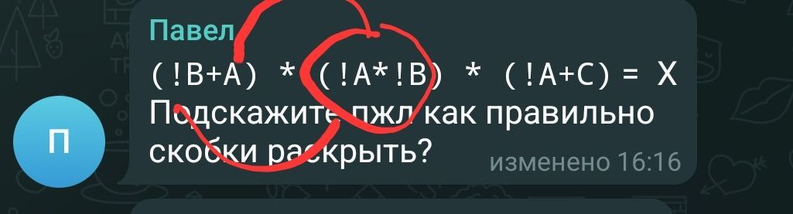

операция логического **ИЛИ** даёт такой же (почти) результат как **сложение**
А операция логического **И** аналогична **умножению**

- `&& это же "И" а & это "ИЛИ"?`
    - И первое и второе "И", одно логическое, второе побитовое

- `Подскажите пжл как правильно скобки раскрыть?`
   `(!B+A) * (!A*!B) * (!A+C) =  X`
    -  Вот по этому правилу A\*(B+C)=A\*B+A\*C\
       А потом то, что осталось после сокращений, перемножила бы с третьей по этому же правилу\
       **(!B+A)\*(!А\*!В) = (!B+A)\*!А\*!В** и дальше согласно правилу = !В\*!А\*!В + А\*!А\*!В, Еще мы знаем, что **А\*!А=0**\
       По сути правило гласит, что произведение числа и суммы равно сумме произведений.  И в нашем выражении была сумма (!В+А), было число А: в нашем выражении вместо него (!А*!В)

- `а можно уточнение а почему мы это правило применяем? если это для    "ИЛИ" идет а в 6 упражнении вроде везде "И"?`

    - ИЛИ это +. По этому правилу раскрываем первые скобки. Получается (!А\*!В\*!В)+(!А\*!В\*А). Далее упрощаем **!В\*!В это !В**, а !А\*А это 0. Получается из перемножения аервых скобок остается (!А\*!В).Затем таким же макаром раскрываем следующие скобки.
    
